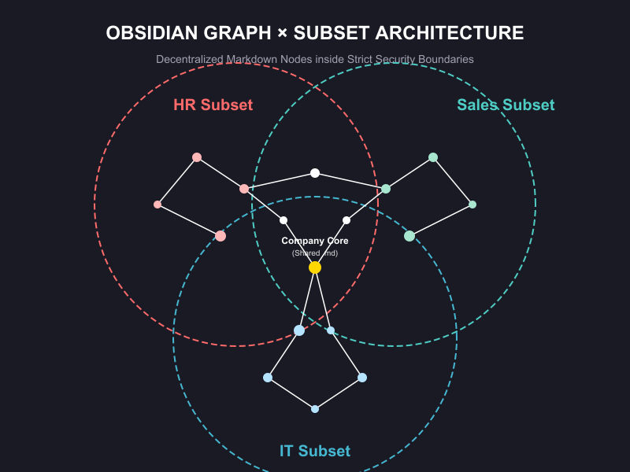

<div align="center">
  
  <h1>🏛️ RAG-Destroyer: The Zero-Vector-DB Architecture</h1>
  <p><b>Deterministic Knowledge Retrieval for the LLM OS Era</b></p>
  <p><i>Repository documentation is maintained in English.</i></p>
</div>

<br>

> *"An LLM is the CPU of an emerging operating system."* — **Andrej Karpathy**

### 💡 Inspiration: Standing on the Shoulders of Giants
This project exists because of **Andrej Karpathy's** brilliant vision of the "LLM OS". He proposed that an LLM shouldn't just be a chatbot, but the core processor of a new operating system—capable of reading files, managing memory, and respecting user permissions natively. 

While the AI industry rushed to dump enterprise data into complex, multi-million dollar, black-box Vector Databases, they forgot the fundamental requirement of any Operating System: **A deterministic, permission-aware File System.**

**RAG-Destroyer** (nickname *Lom RAG*: a Thai shorthand for pushing back on naive "dump everything into vectors" RAG) is my humble attempt to build that missing layer.

---

## 🧪 Proving the Theory: A Manifesto for GURU in the Box
**This project was built to prove a theory, not to be sold as a commercial product.**

The goal of **RAG-Destroyer** is to serve as a **Proof of Concept (PoC)** to demonstrate a singular truth: *A deterministic, Zero-Vector-DB architecture using the "Subset Theory" can eliminate Data Leakage and Hallucination in high-security environments.*

I am not looking for profit or a commercial software license. My only objective was to prove that this architectural approach—the anti-vector-overkill philosophy described above—is the correct foundation for enterprise-grade AI security.

**The theory is proven. The foundation is here.**

This repository is provided as an open-source foundation. You are free to take this architecture, adapt it, integrate it with your enterprise's complex RBAC (Active Directory, OAuth, etc.), and scale it for your own needs. 

*The framework is public. The proof is undeniable. The implementation is now yours.*

---

## 💣 The Vector DB Delusion
The Enterprise AI industry is lying to you. We are forcing semantic search into enterprise environments where **precision, access control (RBAC), and auditability** matter more than "finding similar meanings."

Vector DBs for internal documents are a nightmare:
1. **They hallucinate (Semantic Drift):** Searching for "Maternity Leave" might pull "Sick Leave" because the math thinks they are close.
2. **RBAC is an afterthought:** Telling a vector space "Don't let the intern see the CEO's salary" is computationally expensive and flawed.
3. **They are overpriced:** You are paying cloud providers for something your local file system can do better.

## 🧠 Enter "The Subset Theory"
I killed the Vector DB and replaced it with **The Subset Theory**.

Instead of converting your company's knowledge into billions of unreadable numbers, we flip the architecture:

1. **Deterministic Scouting:** We use high-speed, multi-threaded worker bots to aggressively filter and extract the exact **"Subset"** of relevant data using deterministic metadata, tags, and keyword swarms over an Obsidian (Markdown) vault.
2. **The LMM as a Synthesizer:** Once the perfect "Subset" is isolated, we feed *only* that pristine data to the Large Multimodal Model (LMM). The LMM's only job is to reason and synthesize the final answer.
3. **Zero-Trust by Default:** Because the search happens at the OS file-system level, Role-Based Access Control (RBAC) is native. If a user doesn't have OS-level clearance for a folder, the worker bots simply don't see it. Zero data leakage.

## 🛡️ The "Anti-Roast" Shield
*Before you say it in the Hacker News comments: Yes, I know I just reinvented Keyword Search and Metadata Filtering. And that is EXACTLY the point.*

We got so obsessed with shiny Vector DBs and complex embeddings that we forgot basic software engineering. For 90% of enterprise data, simple deterministic search + LLM reasoning is faster, cheaper, and 100x easier to secure than a black-box vector space. Sometimes, the "dumb" way is the most elegant architecture.

## 🚀 Features
- **Zero Vector DB:** $0 cost, 0 maintenance.
- **100% Native RBAC:** Inherits your organizational silo permissions automatically.
- **Zero Hallucination Retrieval:** If the deterministic search doesn't find it, it doesn't get synthesized.
- **Multi-threaded Speed:** Parallel worker agents (optimized swarm) scout the vault in milliseconds.
- **Industrial Resilience:** Integrated safety cut (circuit breaker) and industrial operational watchdog.
- **Demo Audit Layer:** AI-on-AI QC judging and performance dashboard (built for continuous improvement).

---

## 🛡️ Data privacy, `knowledge/`, and what belongs on GitHub

> [!WARNING]
> **Public GitHub = application code only.** Treat your Markdown vault as **data**, not as part of the public template.

| Location | Typical contents | On public GitHub? |
| :--- | :--- | :--- |
| Repo root (`app.py`, `core/`, `docs/`, Docker files, `config/.env.example`) | Orchestration, UI, docs | **Yes** — safe to push |
| `config/.env` | API keys, tokens | **Never** — gitignored; copy from `config/.env.example` |
| `knowledge/` | Markdown silos ("vault"), RBAC-sensitive text | **No** (default) — `.gitignore` keeps it local / on your machine only |
| `raw_data/` | Drop zone for ingestion | **No** — gitignored |
| `logs/` | Runtime / audit JSON | **No** — gitignored |
| `.obsidian/` | Obsidian workspace metadata | **No** — gitignored |

**Why not push `knowledge/` to a public repo?**  
Once pushed, content is **copied forever** across forks, clones, and search indexes. Enterprise playbooks, customer names, or policy drafts do not belong next to open-source code unless you have explicitly cleared legal + security review.

**If you truly need Git-backed vaults:**

- **Private repository** (org-only) + branch protections — still treat as sensitive; rotate anything that ever leaked to a public remote by mistake.
- **Separate private repo** for `knowledge/` only (or Git submodule) so the public RAG-Destroyer repo stays code-only.
- **No Git at all for vault:** keep `knowledge/` on disk, NAS, S3, or Google Drive — the **Docker Compose** setup bind-mounts `./knowledge` and `./raw_data` from the host; the container never required the vault to live inside the image.

**Google Drive / local paths:** Never commit machine-specific absolute paths or synced folders that contain private files.

---

## 🛠️ Tech Stack & Quick Start

### Option A — Docker (recommended)

Prerequisites: [Docker](https://docs.docker.com/get-docker/) + [Docker Compose v2](https://docs.docker.com/compose/).

```bash
git clone https://github.com/vittaya1973/RAG-Destroyer.git
cd RAG-Destroyer
cp config/.env.example config/.env
# Edit config/.env — set at least GEMINI_API_KEY (or keys for the provider you select in the UI)

mkdir -p knowledge raw_data logs
docker compose up --build
```

Open **http://localhost:8501**

- **Secrets:** real keys live only in `config/.env` (gitignored). Do not commit `.env`.
- **Vault / uploads:** `knowledge/` and `raw_data/` are **bind-mounted** from your host; data persists when the container stops. Populate `knowledge/` on the host (Obsidian vault, rsync, etc.) — nothing in that folder is required inside the GitHub repo.
- **Compose env:** `docker compose` loads `config/.env`. The file must exist (even with placeholders); create it with `cp` as above.

### Option B — Local Python

Requires **Python 3.9+** (Dockerfile uses **3.11** for parity).

```bash
git clone https://github.com/vittaya1973/RAG-Destroyer.git
cd RAG-Destroyer
pip install -r requirements.txt
cp config/.env.example config/.env
# Edit config/.env
mkdir -p knowledge raw_data logs
streamlit run app.py
```

### Configuration (`config/.env`)

See `config/.env.example`. Common entries:

```env
GEMINI_API_KEY=your_key_here
GEMINI_MODEL=gemini-2.5-flash
LINE_NOTIFY_TOKEN=Optional_Token
```

| Category | Technology | Purpose |
| :--- | :--- | :--- |
| **Packaging** | `Docker` + Compose | Reproducible runtime; host-mounted vault |
| **Orchestration** | `Python 3.9+` (3.11 in Docker) | Core control logic |
| **Logic Layer** | `Gemini 2.5 Flash` (+ optional providers in UI) | Query interpretation & response synthesis |
| **Storage** | `Obsidian (Markdown)` in `knowledge/` | Distributed knowledge vault (local/private) |
| **UI Framework** | `Streamlit` | Enterprise Guru dashboard |
| **Resilience** | `Industrial Watchdog` | PID lock, auto-recovery, optional LINE Notify |

---

**Built with respect for the craft.**  
*Architected by RAG Slayer (Bangkok, Thailand).*
